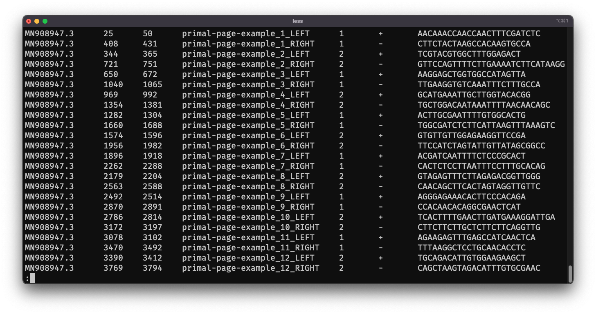
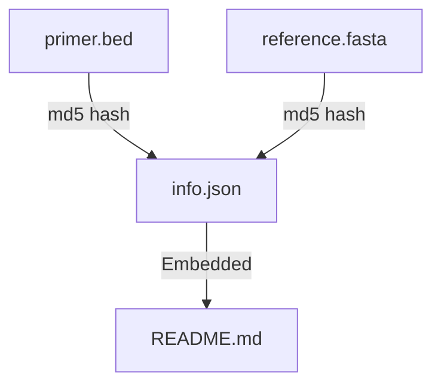

# Adding a scheme

> See [primal-page create](cli.md#primal-page-create) full details.

To add a scheme into ```quick-lab/primerschemes```, primal-page is used to create the info.json metadata file and insure all the files are in the correct format. 

## Creating a scheme from primalscheme(1) files

### .primer.bed
From primalscheme a file should be output called `{scheme-name}.primer.bed`. This file contains all the data needed to produce the primer scheme.

> Old version of primalscheme do not contains the 7th column (PrimerSequence)




## Manual editing of files

Do not do this unless you have to.

If you edit the `info.json` use `primal-page modify regenerate {info.json}` to validate the changes, and regenerate the README.md

If you edit the `primer.bed` or `reference.fasta` use `primal-page dev regenerate {info.json}` to update the hashes in info.json need to be updated.

> If you are editing `primer.bed` or `reference.fasta` something has gone wrong


### Modifying cascade graph

