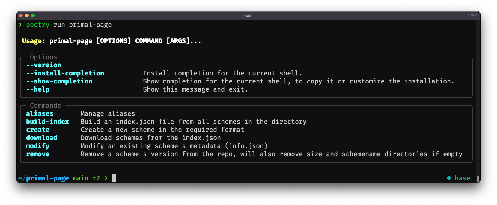

# primal-page



`primal-page` is a python tool for creating and modifying metadata for primerschemes according to the schema used in [labs](https://labs.primalscheme.com/).


## Installation

### via pip
```
pip install primal-page

# To run
primal-page
```

### from source
```
git clone https://github.com/ChrisgKent/primal-page.git
cd primal-page
poetry build

# To run 
poetry run primal-page
```


## Overview

### create
To create the metadata file, use `primal-page create`, which will ask for required data to create the metadata file. For a more details please see [examples](examples.md) page or the [cli](cli.md).

### modify

Once the metadata files are generated, they can be modified with `primal-page modify` and the appropriate option.

>*Do not modify the files manually* [see](examples.md#manual-editing-of-files). 

### aliases

Aliases are a way to provide alternative names for a schemename. For example, the schemename `hbv` (from `hbv/600.v2.1.0`) scheme has the aliases of `hepatitis-b-virus`:`hbv`.  

This is currently used for;

- The searchbar in [labs](https://labs.primalscheme.com). So Searching for `hepatitis` will provide `hbv/600.v2.1.0`
- Backwards compatibility. The [`ncoV-2019`](https://github.com/artic-network/primer-schemes/tree/master/nCoV-2019) schemes are renamed `artic-sars-cov-2`, so we want to ensure that `ncoV-2019/400/v5.3.2` points to the correct scheme.


