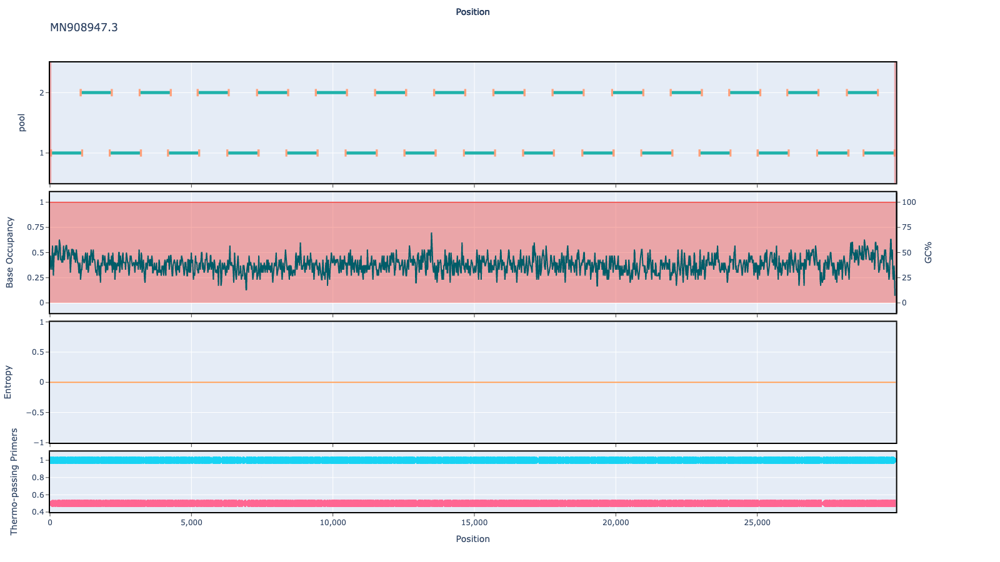

# test-data-123 1000bp v1.0.0

## Overviews



## Details

```json
{
    "ampliconsize": 1000,
    "schemeversion": "v1.0.0",
    "schemename": "test-data-123",
    "primer_bed_md5": "8a878baf863b3f5a0bd7db9ce13d93ff",
    "reference_fasta_md5": "d11d06b5d1eb1d85c69e341c3c026e08",
    "status": "draft",
    "citations": [],
    "authors": [
        "artic network",
        "quick lab"
    ],
    "algorithmversion": "primalscheme3:1.0.0",
    "species": [
        12345
    ],
    "license": "CC BY-SA 4.0",
    "primerclass": "primerschemes",
    "infoschema": "v1.1.0",
    "description": null,
    "derivedfrom": null
}
```


------------------------------------------------------------------------

This work is licensed under a [Creative Commons Attribution-ShareAlike 4.0 International License](http://creativecommons.org/licenses/by-sa/4.0/) 

