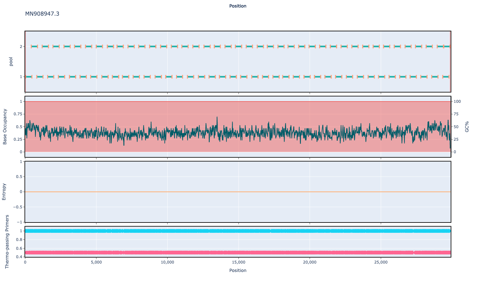

# test 400bp v1.0.0

## Overviews



## Details

```json
<<<<<<< HEAD
{
    "algorithmversion": "primaldigest:1.1.3",
    "ampliconsize": 400,
    "authors": [
        "quick lab",
        "artic network"
    ],
    "citations": [],
    "primer.bed.md5": "f1a91eeadf561d9762cb10bfdb324528",
    "reference.fasta.md5": "3e8964c1ae8dd78e5e35b183903e32df",
    "schemename": "test",
    "schemeversion": "v1.0.0",
    "validated": false
}
=======
{'ampliconsize': 400, 'schemeversion': 'v1.0.0', 'schemename': 'test', 'primer.bed.md5': 'f1a91eeadf561d9762cb10bfdb324528', 'reference.fasta.md5': '3e8964c1ae8dd78e5e35b183903e32df', 'validated': False, 'citations': [], 'authors': ['quick lab', 'artic network'], 'algorithmversion': 'primaldigest:1.1.3'}
>>>>>>> 0e12addf3f7885d5649d3277bb5362ea7da5e0f0
```


------------------------------------------------------------------------

This work is licensed under a [Creative Commons Attribution-ShareAlike 4.0 International License](http://creativecommons.org/licenses/by-sa/4.0/) 

